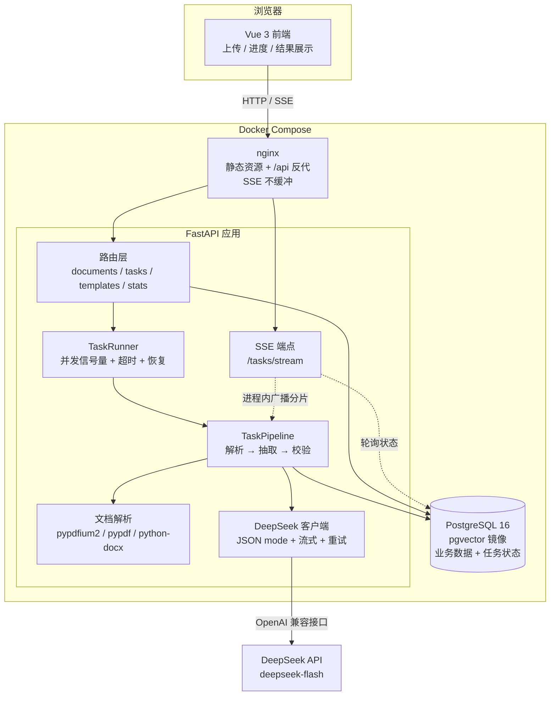
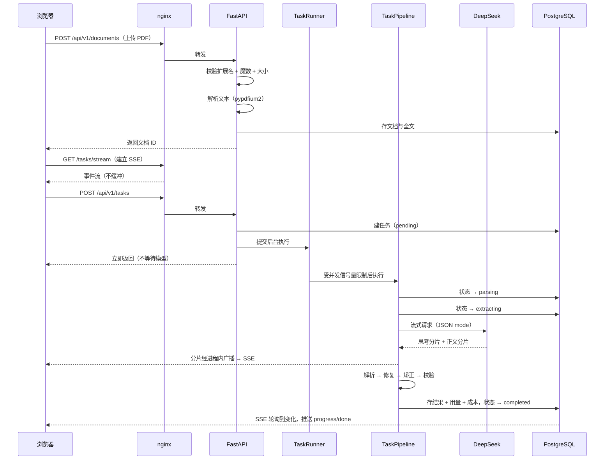

# 智能文档解析服务

> 上传 PDF / Word 文档，用大模型抽取成结构化 JSON —— 一个可以直接上线的企业级 AI 应用

把一份合同丢进去，拿到甲乙方、金额、签订日期；把一份简历丢进去，拿到工作经历与技能清单；
把一份发票丢进去，拿到发票号码、购销双方与价税合计。

**它不是 demo。** 分层架构、数据库迁移、异步任务、结构化日志、SSE 实时进度、
成本核算、Docker 一键部署、431 个后端测试 + 49 个前端测试 —— 这些都是"能上线"与
"能跑通"之间的差距。

---

## 目录

- [解决什么问题](#解决什么问题)
- [功能特性](#功能特性)
- [系统架构](#系统架构)
- [技术栈](#技术栈)
- [快速开始](#快速开始)
- [实测数据](#实测数据)
- [环境变量](#环境变量)
- [常用命令](#常用命令)
- [目录结构](#目录结构)
- [已知限制](#已知限制)
- [文档索引](#文档索引)

---

## 解决什么问题

企业里有大量**格式固定、但需要人工搬运**的文档：合同、简历、发票、采购单、报关单。
人工录入一份合同的关键字段要 3~5 分钟，200 份就是十几小时，而且会出错、无法审计。

这个服务把这件事变成一次上传：

| | 人工录入 | 本服务 |
|---|---|---|
| 单份耗时 | 3~5 分钟 | **1~2 秒** |
| 单份成本 | 人力成本 | **约 ¥0.002** |
| 一致性 | 取决于人 | 由 JSON Schema 保证结构一致 |
| 可审计 | 无 | 每一步都有原始输出、token 用量与成本记录 |

**它不做的事**：不做 OCR（扫描件会明确提示而非硬猜）、不做向量检索
（那是下一个阶段的能力）、不做多用户体系。

---

## 功能特性

### 抽取能力

- **三套内置模板** —— 合同（11 字段，含甲乙方/金额/币种/日期/条款）、
  简历（含工作经历数组与技能标签）、发票（含明细行）
- **自定义 JSON Schema** —— 粘贴一份标准 Schema 即可抽取任意字段，无需改代码。
  Schema 在入库前会做完整的合法性校验
- **同一份文档可用不同模板反复抽取** —— 上传与建任务分离，换模板不用重传文件
- **批量处理** —— 一次拖入多份，逐个校验、逐个入库，**一个坏文件不会让整批失败**

### 工程能力

- **结构化输出有兜底** —— JSON mode + 五级修复阶梯（剥代码块 → 扫描对象 → 去尾逗号
  → 补括号 → 纠正重试），实测能消化掉模型的各种"不配合"
- **结果可信度可见** —— 每个结果都带 `warnings`：哪些必填字段没抽到、哪些值被自动转换、
  文档是否因过长被截断。不把问题藏起来
- **实时进度** —— SSE 推送阶段变化与**模型逐字输出**。首个分片要等 1 秒左右
  （预填充 + 网络），流式让这段等待变得可感知
- **成本可见** —— 每条任务都记录输入/输出/思考/缓存命中 token 与实际花费，
  `/stats` 汇总。回答"这个功能一个月要花多少钱"
- **任务可恢复** —— 服务重启时残留的进行中任务会被标记为可重试，而不是永远卡住

### 生产就绪

- **失败可控** —— 后台任务自建数据库会话、超时保护、并发上限、优雅关闭
- **配置 fail-fast** —— 开了鉴权却没配密钥、生产环境没开鉴权，启动时就会告警或拒绝启动
- **安全默认** —— 扩展名白名单 + 文件头魔数校验、路径穿越防护、响应头注入防护、
  非 root 容器、数据库端口默认不对外暴露
- **可观测** —— 结构化日志（开发彩色 / 生产 JSON）、请求 ID 贯穿全链路、存活与就绪探针分离
- **CI 四条门禁** —— 后端测试（跑在**真实 PostgreSQL** 上）、前端类型与构建、
  接口契约漂移检查、镜像构建。测试全部注入假的模型客户端，**CI 里一次真实 API 都不打**

---

## 系统架构



### 一次抽取的数据流



### 几个关键设计决策

| 决策 | 选择 | 为什么 |
|---|---|---|
| 任务队列 | 进程内 asyncio + 信号量 | 单机部署引入 Redis + worker 是过度设计。代价（多 worker 时并发上限翻倍）写在文档里而不是藏着 |
| SSE 状态通道 | **服务端轮询数据库** | 跨 worker、跨重连、跨进程重启都正确；内存 pub/sub 在多 worker 下会丢事件 |
| SSE 分片通道 | 进程内广播 | 逐字输出数据量太大不适合落库。**尽力而为**，丢了不影响正确性 |
| 前端 SSE | 手写 `fetch` + `ReadableStream` | `EventSource` 无法设置请求头（带不了 API Key）；axios 不支持流式读取 |
| PDF 解析 | pypdfium2 主 + pypdf 兜底 | 前者文本质量更好，后者保证在精简镜像里一定能跑 |
| 配置管理 | 基线 `.env` + 覆盖层 `.env.<环境>` | 后端、compose、Vite 三方共用基线，杜绝"本地能跑线上不行"；差异项集中在覆盖层，一条 `diff` 看完 |
| 数据库镜像 | pgvector 版 | 阶段一用不到向量能力，但下一个阶段用得上，换镜像不如一开始就选对 |

详见 [`docs/architecture.md`](docs/architecture.md)。

---

## 技术栈

| 层 | 选型 |
|---|---|
| 前端 | Vue 3.5 · TypeScript 5.9 · Vite 8 · Pinia 4 · Vue Router 5 · Ant Design Vue 4 |
| 后端 | Python 3.12 · FastAPI · Pydantic 2 · SQLAlchemy 2（异步）· Alembic · uv · ruff |
| 数据库 | PostgreSQL 16（`pgvector/pgvector:pg16` 镜像） |
| AI | DeepSeek `deepseek-flash`（OpenAI 兼容接口，JSON mode + 流式） |
| 部署 | Docker · Docker Compose · nginx |
| 测试 | pytest（431 项）· Vitest（49 项） |

---

## 快速开始

### 前置条件

- Docker 与 Docker Compose
- 一个 DeepSeek API Key（[platform.deepseek.com](https://platform.deepseek.com)）

### 三步启动

```bash
cd smart-doc-parser
cp .env.example .env          # 然后填入你的 DEEPSEEK_API_KEY
docker compose up -d --build
```

打开 **<http://localhost>**，把 `samples/contract.pdf` 拖进去，选择「合同」模板，点「开始抽取」。

- 接口文档（Swagger）：<http://localhost:8000/docs>
- 健康检查：<http://localhost/api/v1/health/ready>

### 首次使用会看到什么

1. 拖入文件 → 上传进度条 → 提示"1 个文件已上传"
2. 任务出现在下方列表，状态从「排队中」变为「解析文档」→「模型抽取中」
3. 进度条实时推进，点进详情能看到**模型正在逐字生成 JSON**
4. 1~2 秒后完成，字段按中文标签排布成卡片（甲方 / 乙方 / 合同金额…）
5. 切到「原始输出」标签可以看到模型的原始返回

> **关于首次启动**：第一次运行时数据库需要初始化，backend 容器会先等数据库就绪、
> 再自动执行迁移，这个过程大约 10~20 秒。`docker compose ps` 显示三个服务都 `healthy`
> 就说明好了。

---

## 实测数据

以下数字来自本项目的真实运行记录，不是估算：

| 指标 | 实测值 |
|---|---|
| 单份合同端到端耗时 | **1.1~2.1 秒**（其中首字延迟 0.9~1.4 秒） |
| 单份合同成本 | **¥0.0014~0.0024**（输入 1337 token + 输出 116~235 token） |
| 1000 份合同成本 | 约 ¥2 |
| 前缀缓存命中 | **1152 / 1337 = 86%**（同一模板重复抽取） |
| 抽取准确率 | 内置的三份示例文档上，必填字段全部正确、零告警 |

### 关于 `deepseek-flash` 的思考 token：同一 prompt 连跑 5 次的实测

`deepseek-flash` 是推理模型，有时会先输出一段思考再给答案。**是否触发是不确定的**——
用完全相同的 prompt、`temperature=0` 连跑 5 次：

| 运行 | 思考 token | 输出 token | 首字延迟 | 成本 |
|---|---|---|---|---|
| 1 | 0 | 116 | 1.04s | ¥0.0014 |
| 2 | **119** | **235** | 1.37s | **¥0.0024** |
| 3 | 0 | 116 | 1.09s | ¥0.0014 |
| 4 | 0 | 120 | 0.86s | ¥0.0015 |
| 5 | 0 | 116 | 1.19s | ¥0.0014 |

**5 次里有 1 次触发了思考，而那一次的输出 token 与成本都翻了倍**——
因为思考 token **计入 `completion_tokens`、占用 `max_tokens` 预算、按输出价计费**。

这不是一个可以忽略的细节：批量跑 100 份就会遇到二十来次，
如果 `max_tokens` 给小了，那些文档会**因为思考耗尽预算而返回空内容**。
所以代码里显式检查 `finish_reason == "length"` 并在首次触发时翻倍重试，
默认值也定在 8192 而不是 2048。

**为什么成本核算算"分水岭"**：把成本算出来、记进数据库、显示在界面上，
才能回答"这个功能一个月要花多少钱""把 max_tokens 调大一倍值不值"。
Demo 只告诉你"能跑"，生产系统要告诉你"跑这一下多少钱"。

---

## 环境变量

配置在**仓库根目录**，分两层：`.env` 是基线（全部 41 个键），
`.env.<环境名>` 是覆盖层（只写差异项）。后端（pydantic-settings）、
docker-compose、前端（Vite 的 `envDir`）三方读同一份基线。

```bash
cp .env.example .env              # 基线，本地开发只需要这一步
cp .env.production.example .env.production   # 仅生产部署需要
```

关键配置（完整清单与说明见 [`.env.example`](.env.example)）：

| 变量 | 默认值 | 说明 |
|---|---|---|
| `DEEPSEEK_API_KEY` | *（必填）* | DeepSeek 密钥 |
| `DEEPSEEK_MODEL` | `deepseek-flash` | 换模型只改这一行，不用动代码 |
| `AUTH_ENABLED` | `false` | 是否要求 `X-API-Key`。**公网部署请设为 true** |
| `API_KEYS` | 空 | 逗号分隔。开了鉴权却留空会导致启动失败（故意的） |
| `MAX_UPLOAD_SIZE_MB` | `20` | 单文件大小上限 |
| `MAX_CONCURRENT_TASKS` | `3` | 同时执行的抽取任务数 |
| `LLM_MAX_TOKENS` | `8192` | **不要调小**：推理模型的思考 token 会占用这个预算 |
| `MAX_INPUT_CHARS` | `100000` | 超长文档的截断阈值 |
| `FRONTEND_PORT` | `80` | 前端对外端口 |

### 分环境：基线 + 覆盖层

配置是**两份文件的叠加**，不是两套独立的配置：

| 文件 | 入库 | 作用 |
|---|---|---|
| `.env.example` | ✅ | 完整模板，全部 41 个键，开发取向的默认值 |
| `.env` | ❌ | 配置**基线**，本地和线上都读它 |
| `.env.production.example` | ✅ | 生产**只列需要改的 8 个键** |
| `.env.production` | ❌ | 生产覆盖层，同名键覆盖基线 |

```bash
make up          # 开发：只读基线
make up-prod     # 生产：基线 + 覆盖层
                 # 等价于 docker compose --env-file .env --env-file .env.production up -d --build
```

**为什么用覆盖层而不是两份完整配置**：两个环境的差异用 `diff` 就能看完，
改一处基线所有环境受益，也不会出现"同一个键改了两份中的一份"这种漂移。

**代价与防护**：覆盖层只写差异项，漏写任何一项都会**静默继承基线的开发值**。
所以生产模式下有一道启动预检——密码还是默认值、没开鉴权、CORS 是 `*`、
密钥是占位值，任何一条都会**拒绝启动并列出全部问题**，而不是带着开发配置上线。

### 本地和线上还有什么差异

| | 后端 | 前端 | 数据库 |
|---|---|---|---|
| **Docker 部署** | compose 注入环境变量 | nginx 反代 `/api/` | 服务名 `db` |
| **本地裸机开发** | 读基线 `.env` | Vite 代理 `/api/` | `localhost` |

前端的接口地址始终是**相对路径** `/api/v1`，因此**前端没有任何分环境配置**——
`VITE_API_BASE_URL` 在开发和生产下是同一个值。唯一差异是 `POSTGRES_HOST`
（容器里 `localhost` 指向容器自身），由 compose 显式覆盖，写在了 `.env.example` 的注释里。

---

## 常用命令

```bash
make help          # 查看全部命令

# 部署
make up            # 构建并启动全部服务（开发配置）
make up-prod       # 生产部署（基线 + .env.production 覆盖层）
make down          # 停止（保留数据）
make logs          # 跟踪日志
make ps            # 查看状态

# 本地开发（数据库跑在容器里，前后端跑在宿主机上热重载）
make dev-db        # 只启动 PostgreSQL
make dev-backend   # 后端热重载
make dev-frontend  # 前端 dev server

# 质量门禁（与 CI 跑的是同一组命令）
make check         # 后端：ruff check + format --check + pytest（含 80% 覆盖率门禁）
make check-web     # 前端：lint + type-check + test + build
make check-api     # 接口契约：重新生成 OpenAPI 与 TS 类型，比对有无漂移

# 数据库
make migrate       # 应用迁移
make revision m="add xxx"   # 生成迁移
make db-reset      # 清空数据库重建（会删除所有数据）

# 其他
make gen-api       # 由后端生成 OpenAPI schema 并刷新前端 TS 类型
make smoke-llm     # 用真实 API 跑一次抽取，验证连通性（会消耗约 ¥0.0014）
```

---

## 目录结构

```
smart-doc-parser/
├── .env.example               # 配置模板（完整 41 键）
├── .env.production.example    # 生产覆盖层模板（只列要改的 8 键）
├── docker-compose.yml         # 一键部署
├── docker-compose.dev.yml     # 本地开发覆盖（只暴露数据库端口）
├── Makefile                   # 常用命令
├── .github/workflows/ci.yml   # CI：测试 / 类型 / 契约漂移 / 镜像构建
├── samples/                   # 演示文档
├── docs/                      # 详细文档
├── backend/
│   ├── app/
│   │   ├── core/              # 配置、日志、错误、鉴权、中间件
│   │   ├── db/                # 模型、会话、迁移
│   │   ├── api/v1/            # 路由（含 SSE 端点）
│   │   ├── services/          # 存储、解析、任务编排
│   │   └── ai/                # DeepSeek 客户端、prompt、Schema 校验、模板
│   ├── alembic/               # 数据库迁移
│   ├── scripts/               # 运维脚本
│   └── tests/                 # 431 项测试
└── frontend/
    ├── src/
    │   ├── api/               # 类型化接口层 + SSE 客户端
    │   ├── stores/            # Pinia
    │   ├── views/             # 四个页面
    │   ├── components/        # 业务组件
    │   └── utils/             # SSE 解析、格式化、下载
    ├── nginx/nginx.conf       # SSE 不缓冲的关键配置
    └── Dockerfile
```

---

## 已知限制

主动写出来的限制，比等着别人发现要好：

| 限制 | 说明 | 生产环境的做法 |
|---|---|---|
| **不支持扫描件** | 没有文本层的 PDF 会明确提示而非静默失败。OCR 属于后续规划 | 接入 OCR 服务做前置转换 |
| **API Key 存在 localStorage** | 任何 XSS 都能读走它。这是演示场景下避免引入完整登录体系的取舍 | 后端会话 + HttpOnly Cookie，或把密钥留在服务端代理层 |
| **任务调度器是进程内的** | `BACKEND_WORKERS > 1` 时每个 worker 各有一份并发计数，实际上限会翻倍 | 把任务执行拆到独立 worker（接口已预留） |
| **SSE 分片是尽力而为** | 多 worker 部署时可能收不到别的 worker 上的模型逐字输出（进度与结果不受影响） | 换成 Redis Pub/Sub |
| **单机部署** | 没有考虑多副本、灰度、限流熔断 | 视规模引入网关与编排 |
| **前端未做 i18n** | 界面文案为中文硬编码 | 接入 vue-i18n |

还有一些**刻意的省略**：没有引入 Celery/Redis、没有做 CSV 导出、没有做任务取消。
这些都能加，但现阶段加进去只会增加运维成本而不解决实际问题。

---

## 文档索引

| 文档 | 内容 |
|---|---|
| [`docs/architecture.md`](docs/architecture.md) | 分层设计、数据模型、状态机、关键技术决策与权衡、扩展路径 |
| [`docs/api.md`](docs/api.md) | 全部接口、错误码表、SSE 事件协议、curl 示例 |
| [`docs/deployment.md`](docs/deployment.md) | 云服务器上线步骤、HTTPS、备份、安全加固清单 |
| [`docs/development.md`](docs/development.md) | 本地开发、如何加模板/加解析器、迁移流程、调试技巧 |
| [`docs/commands.md`](docs/commands.md) | 全部命令速查，含每条 make 命令背后实际执行的内容 |
| [`docs/interview-notes.md`](docs/interview-notes.md) | 项目讲解稿、"问题→方案→结果"故事、预设追问与回答 |

---

## License

MIT
