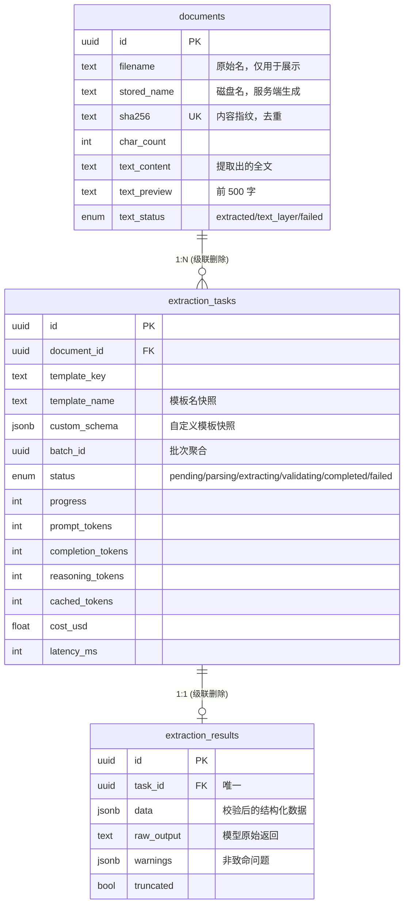
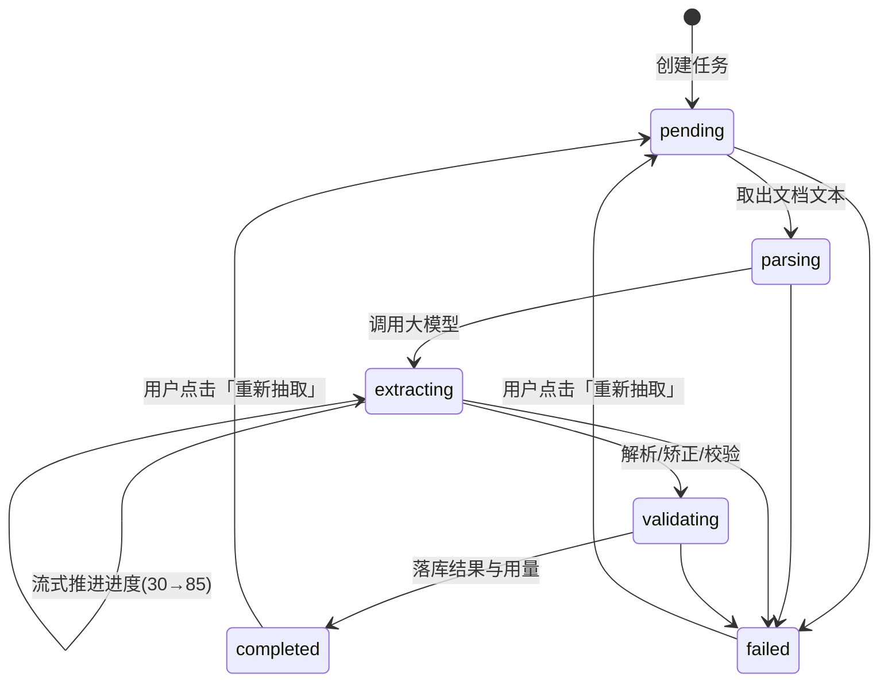

# 架构设计

本文说明系统的分层、数据模型、关键流程，以及**每个技术选择背后的权衡**。
最后一部分是"如果要继续演进，该怎么走"。

---

## 1. 分层

```
┌──────────────────────────────────────────────────────────────┐
│  api/            HTTP 层：路由、参数校验、鉴权、SSE          │
│                  职责边界：只做协议转换，不写业务逻辑         │
├──────────────────────────────────────────────────────────────┤
│  services/       业务层：存储、解析、任务编排、模板、统计     │
│                  职责边界：不感知 HTTP，可脱离 FastAPI 测试   │
├──────────────────────────────────────────────────────────────┤
│  ai/             模型层：客户端、prompt、Schema 校验、模板     │
│                  职责边界：不碰数据库，只依赖 LLMClient 协议   │
├──────────────────────────────────────────────────────────────┤
│  db/             数据层：ORM 模型、会话管理、枚举             │
└──────────────────────────────────────────────────────────────┘
```

**为什么把 `ai/` 单独成层而不是塞进 `services/`**：
模型调用是这个系统里最不确定的部分（会超时、会返回坏 JSON、会因为
`max_tokens` 太小而返回空内容）。把它隔离出来，可以用一个假的
`LLMClient` 替换掉整个网络依赖，**让 420 个测试一次真实 API 都不打**。

`ai/base.py` 里的 `LLMClient` 是一个 `Protocol`，不是抽象基类。
这样 `FakeLLMClient` 不需要继承任何东西，也不需要 import openai。

---

## 2. 数据模型



### 几个建模上的决定

**为什么 `extraction_results` 单独一张表，而不是把结果塞进任务行？**
任务的列表查询是高频操作，而结果（`data` + `raw_output`）体积大且很少被读到。
分表之后，列表查询可以用 `load_only()` 精确控制取哪些列，
不会因为一次"看看有哪些任务"而把几十 MB 的 JSON 拉进内存。

**为什么 `template_name` 和 `custom_schema` 存快照而不是外键？**
模板会被改名甚至删除。历史任务必须能正确显示"当时用的是哪个模板"，
而且重跑时要复现当时的行为。存快照的代价是少量冗余，换来的是历史数据的自洽。

**为什么 `documents.sha256` 加了唯一约束？**
同一份文件重复上传时复用已有记录，而不是存两份。这既省磁盘，
也避免同一个文件产生两条互不相干的历史。并发上传同一文件时靠唯一约束兜底：
捕获 `IntegrityError` 后回滚、删掉刚写的文件、复用已有记录。

### 任务状态机



**只有 `completed` 和 `failed` 是终态。** 服务重启时，
`recover_interrupted_tasks()` 会把所有非终态的任务标记为 `failed`
并带上 `SERVICE_RESTARTED`，同时提供一个可点击的重试入口。

**为什么是标记失败而不是自动重新入队？**
自动重跑会在"这个任务必然失败"的情况下（例如文档已损坏）形成无限重启循环，
把 API 额度烧光。重试交给用户显式点击。

---

## 3. 一次抽取的完整流程

```
POST /api/v1/tasks
  └─ 创建任务行（pending）→ 交给 TaskRunner → 立即返回
                                              │
TaskRunner._run_one(task_id)                  │
  ├─ async with self._semaphore               │  ← 并发上限
  └─ asyncio.wait_for(pipeline.run, timeout)  │  ← 超时保护
                                              ▼
TaskPipeline.run(task_id)
  ├─ async with session_scope()   ← 自建会话，绝不复用请求的会话
  ├─ 状态 → parsing (10%)
  ├─ 取 document.text_content；为空则抛 NoTextLayerError
  ├─ 状态 → extracting (30%)
  ├─ Extractor.extract(...)
  │    ├─ 超长文档截断（头 70% + 尾 30%）
  │    ├─ 构造 prompt（发请求前断言含 "json"）
  │    ├─ DeepSeekClient.complete_json（流式）
  │    │    ├─ 每个分片 → chunk_bus 广播（前端逐字显示）
  │    │    ├─ 每前进 ≥3% 且距上次 ≥1s → 写一次进度（节流）
  │    │    └─ finish_reason == "length" → 预算翻倍重试一次
  │    ├─ parse_json_lenient（五级修复阶梯）
  │    ├─ 失败 → 带纠正指令重试一次
  │    ├─ coerce_data（类型矫正）
  │    └─ validate_data（JSON Schema 校验 → warnings）
  ├─ 状态 → validating (90%)
  ├─ 存结果 + 用量 + 成本
  └─ 状态 → completed (100%)
```

---

## 4. 关键决策与权衡

这一节是本文档最重要的部分。每条都写清楚**放弃了什么**——只有知道边界在哪，
才能判断什么时候该换方案。

### 4.1 为什么不用 Celery / RQ / ARQ

**选择**：进程内 `asyncio` 任务 + `asyncio.Semaphore` 限并发。

**理由**：单机部署下，Redis + 独立 worker 进程换来的是额外的运维成本
（多一个中间件要监控、要备份、要处理版本兼容），而它提供的能力
（跨进程分发、水平扩容）在这个规模上用不到。

**放弃了什么**：

- `BACKEND_WORKERS > 1` 时，每个 worker 有各自的信号量，实际并发上限翻倍。
  **启动时会打印醒目 WARNING**，而不是静默地让配置失效
- 任务状态与执行者绑定在同一个进程里，无法把 API 层和 worker 层分别扩容

**什么时候该换**：任务量超过单机处理能力，或需要 API 层独立扩容时。

**换起来有多难**：`TaskPipeline` 的接口是 `async def run(task_id: UUID) -> None`，
不依赖任何进程内状态。把它搬到 ARQ 或 Celery 只需要替换 `TaskRunner`
这一个类，业务代码零改动。

### 4.2 为什么 SSE 的状态推送走数据库轮询

**选择**：服务端每 1 秒查一次数据库，把变化过的任务推给客户端。

**理由**：内存 pub/sub 方案在 `--workers > 1` 时**会静默丢事件**——
任务跑在 worker A，而 SSE 连接落在 worker B，B 的内存里根本没有那些事件。
这类问题的表现是"进度条偶尔不动"，极其难排查。

轮询数据库天然没有这个问题：跨 worker、跨重连、跨进程重启都正确。

**放弃了什么**：最多一个轮询周期（1 秒）的延迟。
对进度条来说完全够用——用户感知不到 1 秒的差异。

**为什么不做 `Last-Event-ID` 重放**：连接建立时服务端会先推一份**全量快照**，
晚订阅者立刻就能看到当前状态，不需要重放历史事件。少一张事件表，
少一处可能出错的地方。

### 4.3 为什么流式分片走进程内广播

**选择**：模型逐字输出通过 `ChunkBus`（进程内 `asyncio.Queue`）推给 SSE。

**理由**：单个任务会产生上百个分片。每个分片写一次数据库是不可接受的
（连接池、WAL、磁盘 IO 全被无意义地消耗）。而这条通道只承载"锦上添花"的
展示信息——丢了不影响正确性。

**放弃了什么**：多 worker 部署时，订阅者收不到别的 worker 上跑的模型分片。

**这是刻意的分层设计，两条通道各司其职**：

| | 状态与进度 | 流式分片 |
|---|---|---|
| 通道 | 数据库轮询 | 进程内广播 |
| 可靠性 | 强一致 | 尽力而为 |
| 跨 worker | 支持 | 不支持 |
| 断线重连 | 快照补齐 | 丢失的部分不再补 |
| 丢了会怎样 | 不可能 | 少看几个字，结果不受影响 |

队列有 512 条上限，满了丢**最旧**的：用户更关心"现在写到哪了"，
而不是"十个字之前写了什么"。慢客户端不会让服务端内存持续增长。

### 4.4 为什么用 JSON mode 而不是 Function Calling

**选择**：`response_format={"type": "json_object"}` + 服务端 JSON Schema 校验。

**理由**：实测 DeepSeek **不支持 `json_schema` 严格模式**
（返回 `This response_format type is unavailable now`），
因此结构约束只能靠 prompt 描述 + 服务端校验。

Function Calling 在这个场景下没有优势：我们不需要模型"决定调用哪个工具"，
只需要它"填一张表"。而 JSON mode 的输出更直接，也更容易做修复。

**放弃了什么**：模型端不做结构约束，因此必须有完善的服务端兜底。
这就是下面 4.5 存在的原因。

### 4.5 为什么 Schema 允许所有字段为 null

**这是一个踩过坑之后改的设计。**

最初的实现把字段声明成 `{"type": "string"}`，而 prompt 里写的是
"没抽到的字段填 null"。结果模型老老实实返回 `null` 时，
**JSON Schema 校验把它判成了类型错误**——用户看到满屏"类型不匹配"的告警，
而实际上是系统自己在报假警。

修正后：所有字段声明为 `["string", "null"]`，
真正"必填却没抽到"的判断交给一个针对 `null` 的显式检查。

**为什么不能靠 `required` 关键字**：JSON Schema 的 `required` 只检查
**键是否存在**。而模型的标准做法是返回 `{"effective_date": null}`——
键是在的，值是空的。靠 `required` 完全查不出来。

### 4.6 为什么 PDF 用两个解析器

**选择**：`pypdfium2` 为主，`pypdf` 兜底，运行时自动降级。

**理由**：pypdfium2 是 Google PDFium 的绑定，文本提取质量（尤其是分栏与表格）
明显更好。但它需要加载自带的动态库，在极端精简的容器里可能失败。

用"尝试导入 + 运行时降级"而不是硬依赖，让服务在任何环境下都能启动——
最多是解析质量下降，而不是整个服务起不来。

**实测发现的一个坑**：`pypdf` 处理 CID 字体的中文 PDF 时，
会把字形映射到**康熙部首区**——"方"被提取成 `⽅`(U+2F45)。
看起来一模一样，但码位不同，会导致精确匹配全部失效，
而肉眼看日志完全正常。

修复方式是在文本清洗阶段做**针对性的 NFKC 归一化**（只处理兼容副本区段，
不动全角标点）。这个修复有专门的回归测试。

### 4.7 为什么文档要截断而不是全量送入

**选择**：超过 `MAX_INPUT_CHARS`（默认 10 万字）时，
保留**头 70% + 尾 30%**，中间以显式标记省略。

**理由**：合同的关键信息（甲乙方、金额）在开头，**签署日期与落款在结尾**。
只保留开头会丢掉落款。

截断处会写入明确的省略标记，并在结果里返回 `truncated: true` 与一条告警——
不告知截断的话，模型会把"没找到"当成"不存在"，产生静默的低质量结果。

**为什么不做 map-reduce 分块抽取**：对于绝大多数合同/简历/发票（都在 10 万字以内），
分块只会引入"跨块字段如何合并"的新问题。这是留给真正需要处理超长文档时的演进方向。

---

## 5. 可靠性与安全

### 后台任务的会话管理

`TaskPipeline` **自己创建数据库会话**，绝不复用请求的会话。
请求一结束会话就被关闭，后台任务再往里写会抛
`This session is closed` 或悄悄泄漏连接池里的连接。
这类问题在开发机上往往看不出来（请求量小、连接池宽裕），
到线上高并发时才以"连接耗尽"的形式爆出来。

### 取消的正确传播

超时或关闭时 `asyncio.wait_for` 会取消任务。Pipeline 里**显式重新抛出
`CancelledError`**——如果写一个宽泛的 `except Exception` 把它吞掉，
`wait_for` 无法感知取消，任务会一直挂在"进行中"，而后台其实早就没人管了，
模型调用还在继续烧钱。

### 优雅关闭

`TaskRunner.shutdown()` 先停止接收新任务，然后给在途任务 5 秒宽限期。
直接全部 cancel 会让"已经调用了模型、只差写库"的任务丢掉结果——
钱花了，结果没了，用户还得重跑一次。

### 安全措施

| 风险 | 措施 |
|---|---|
| 改扩展名绕过类型检查 | **文件头魔数校验**（`%PDF-`、`PK\x03\x04`）。扩展名是用户随便改的 |
| 路径穿越 | 存储名由服务端生成（`{uuid4}{ext}`），**用户提供的文件名永不参与路径拼接**；再加一层 `resolve()` 前缀校验 |
| 响应头注入 | 文件名过滤控制字符（`\r\n` 进 `Content-Disposition` 能注入额外响应头） |
| 超大文件撑爆磁盘 | 分块读取，超出上限立即中断；nginx 层 `client_max_body_size` 更早拦截 |
| 密钥时序攻击 | `secrets.compare_digest` 而非 `==` |
| 开了鉴权却忘配密钥 | **启动直接失败**，而不是让所有请求都 401 再说 |
| 生产环境没开鉴权 | 启动打醒目 WARNING，部署文档的检查清单第一条 |
| 容器被攻破 | 非 root 用户运行（uid 1001） |
| 数据库端口裸奔 | 基础 compose **不暴露 5432**，只有 dev 覆盖文件才暴露且只绑定回环地址 |
| 密钥进前端产物 | Vite 只注入 `VITE_` 前缀的变量，`DEEPSEEK_API_KEY` 永远不会被打进浏览器代码 |

---

## 6. 已知边界与演进路径

按"什么时候需要"排序：

| 边界 | 触发条件 | 演进方式 |
|---|---|---|
| 多 worker 下并发上限翻倍 | 需要扩容 API 层 | 把 `TaskPipeline` 拆到独立进程（接口已预留），用 ARQ/Celery 替换 `TaskRunner` |
| SSE 分片跨 worker 丢失 | 同上 | `ChunkBus` 换成 Redis Pub/Sub，接口不变 |
| 不支持扫描件 | 用户上传了扫描件 | 前置 OCR（PaddleOCR / 云服务），在 `services/parsing/` 加一个分支 |
| 无法取消进行中的任务 | 用户误提交了大批量任务 | 保存后台任务引用，加 `cancel()` 接口 |
| 没有限流 | 公网暴露后被刷 | nginx `limit_req` 或应用层滑动窗口 |
| 单点数据库 | 数据量或可用性要求提升 | 读写分离 + 连接池外置（PgBouncer） |
| 成本统计是估算 | 需要精确对账 | 接入官方账单 API 做核对 |

**明确不做的事**：不引入向量检索（那是 RAG 阶段的能力）、
不做多租户、不做工作流编排。这些都能加，但在这里加只会增加复杂度而不解决问题。
