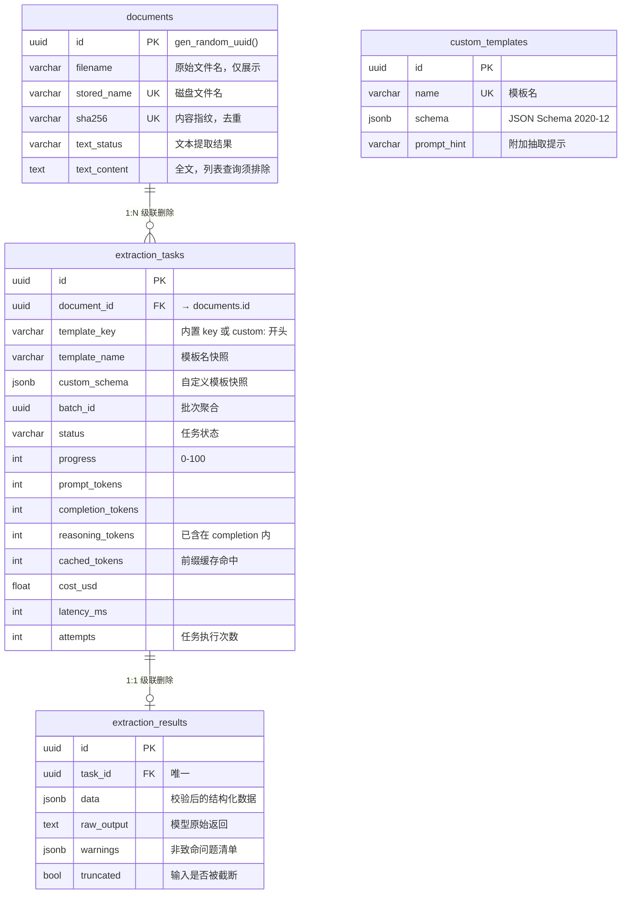
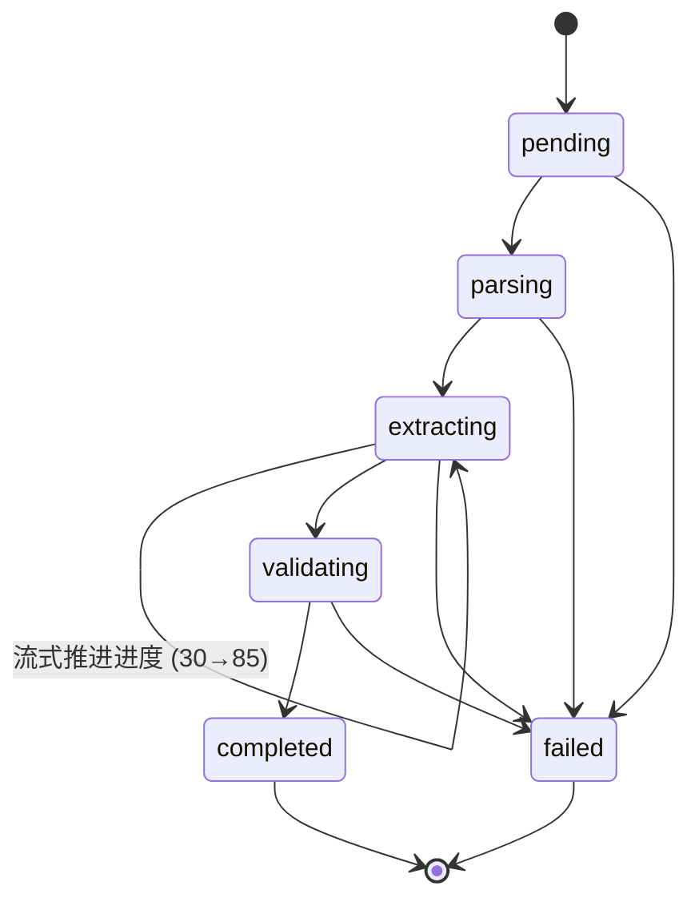

# 数据库表结构

PostgreSQL，**4 张业务表** + 1 张 Alembic 版本表（`alembic_version`，由 Alembic 自行维护）。

本文逐列给出字段注释。表结构设计上的取舍（为什么结果单独一张表、为什么模板存快照等）
见 [`architecture.md` 第 2 节](architecture.md#2-数据模型)，这里只描述**现状**。

> **权威来源**：ORM 模型 [`backend/app/db/models.py`](../backend/app/db/models.py)。
> 实际 DDL 由迁移 [`20260913_0502_1a027b56e714_create_initial_schema.py`](../backend/alembic/versions/20260913_0502_1a027b56e714_create_initial_schema.py) 生成。
> 本文的列类型、可空性、默认值与索引已与实例的 `\d+` 实际输出逐列核对。
> 本文与模型不一致时**以模型为准**，并请顺手更新本文。

---

## 1. 总览



| 表 | 一行代表 | 量级 |
|---|---|---|
| `documents` | 一份上传的文件及其解析出的纯文本 | 每份文件一行 |
| `extraction_tasks` | 一次「用某模板抽取某文档」的任务，含状态机与用量成本 | 每份文档可有多行（换模板重跑即新任务） |
| `extraction_results` | 某次任务抽取出的结构化数据与模型原始输出 | 与任务一对一 |
| `custom_templates` | 用户自定义的 JSON Schema 模板 | 用户手动维护，量很小 |

`custom_templates` **没有外键连到 `extraction_tasks`**：任务里存的是模板快照，不是引用。
模板被删除后，历史任务照样能显示当时用的是哪个模板、并按当时的 schema 复现结果。

---

## 2. 通用约定

**主键**：4 张表都是 `uuid`，主键名 `pk_<表名>`，默认值 `gen_random_uuid()`。
这是 PG 13+ 的内置函数，**不需要 `CREATE EXTENSION pgcrypto`**。

**时间戳**：每张表都有 `created_at` / `updated_at`，均为带时区的 `timestamptz`。
默认值由**数据库**生成（`now()`），不使用应用服务器时间——多实例部署时各机器时钟不一致
会让「按时间倒序」的分页结果错乱。`updated_at` 在 ORM 侧配了 `onupdate=now()`，
只有走 ORM 更新才会刷新；**直接写 SQL 改数据不会自动更新这一列**。

**约束命名**：`Base.metadata` 上挂了统一的 `naming_convention`，因此索引与约束名都是可预测的：

| 前缀 | 含义 | 示例 |
|---|---|---|
| `pk_` | 主键 | `pk_documents` |
| `uq_` | 唯一约束 | `uq_documents_sha256` |
| `fk_` | 外键 | `fk_extraction_tasks_document_id_documents` |
| `ck_` | CHECK 约束 | `ck_extraction_tasks_progress_range` |
| `ix_` | 普通索引 | `ix_documents_created_at` |

不配命名规则的话 PostgreSQL 会自行取名（如 `documents_sha256_key`），
导致 Alembic 自动生成的迁移里出现不可读的名字，后续想 `DROP` 时无从下手。

**JSONB**：结构化数据一律用 `jsonb` 而不是 `json`——前者可索引、去重键、写入时即校验格式。

**没有软删除**：删除是物理删除，靠外键的 `ON DELETE CASCADE` 连带清理子行。

---

## 3. `documents`

上传的文件及其解析出的纯文本。

| 字段 | 类型 | 可空 | 默认 | 注释 |
|---|---|---|---|---|
| `id` | `uuid` | 否 | `gen_random_uuid()` | 主键 |
| `filename` | `varchar(255)` | 否 | — | 用户上传时的原始文件名，已做安全清洗。**仅用于展示，绝不参与磁盘路径拼接** |
| `stored_name` | `varchar(128)` | 否 | — | 磁盘上的实际文件名，由服务端生成：`<uuid4 的 32 位十六进制><扩展名>`，如 `9f2c1ab8….pdf`。唯一 |
| `mime_type` | `varchar(128)` | 否 | — | 由**扩展名**推导得到的规范 MIME，不是客户端声明的那个 |
| `size_bytes` | `bigint` | 否 | — | 文件字节数。上限由 `MAX_UPLOAD_SIZE_MB` 控制（默认 20 MB） |
| `sha256` | `varchar(64)` | 否 | — | 文件内容指纹（十六进制小写）。唯一，**重复上传同一份文件会复用已有记录而不是存两份** |
| `page_count` | `integer` | 是 | `NULL` | 页数。只有 PDF 有固定分页；`.docx` / `.txt` / `.md` 为 `NULL` |
| `char_count` | `integer` | 否 | `0` | 清洗后正文的字符数（`len(text_content)`）。列表页展示用，省得为了显示数字去拉全文 |
| `text_content` | `text` | 是 | `NULL` | 提取出的完整纯文本。**体积可能很大，任何列表查询都必须显式排除这一列** |
| `text_preview` | `varchar(500)` | 是 | `NULL` | 正文折叠空白后的前 500 字，列表页预览 |
| `text_status` | `text_status` | 否 | `'extracted'` | 文本提取结果，见[第 7 节](#7-枚举类型) |
| `text_error` | `varchar(500)` | 是 | `NULL` | 提取失败或未检出文本层的原因。`no_text_layer` 时写入给用户看的说明文案 |
| `created_at` | `timestamptz` | 否 | `now()` | 创建时间 |
| `updated_at` | `timestamptz` | 否 | `now()` | 更新时间 |

**约束与索引**

| 名称 | 类型 | 说明 |
|---|---|---|
| `pk_documents` | 主键 | `id` |
| `uq_documents_sha256` | 唯一 | 内容去重；并发上传同一文件时靠它兜底（捕获 `IntegrityError` → 回滚 → 删掉刚写的文件 → 复用已有记录） |
| `uq_documents_stored_name` | 唯一 | 磁盘文件名不重复 |
| `ck_documents_size_bytes_non_negative` | CHECK | `size_bytes >= 0` |
| `ix_documents_created_at` | 索引 | 列表默认按创建时间倒序 |

**两个容易踩的点**

- `text_content` 存 `NULL` 而不是空串，让「没有正文」（扫描件）和「正文为空」在库里可区分。
- `text_status` 的 `failed` 值在枚举里保留了，但**当前实现不会写入**：解析彻底失败（文件损坏）
  时接口直接返回错误响应，不落库。实际只有 `extracted` 与 `no_text_layer` 两种值会被写入。

---

## 4. `extraction_tasks`

一次抽取任务：某份文档 + 某个模板。这张表是列表页与进度轮询的主力。

| 字段 | 类型 | 可空 | 默认 | 注释 |
|---|---|---|---|---|
| `id` | `uuid` | 否 | `gen_random_uuid()` | 主键 |
| `document_id` | `uuid` | 否 | — | → `documents.id`，`ON DELETE CASCADE`。文档删除时任务一并删除 |
| `template_key` | `varchar(64)` | 否 | — | 内置模板 key（`contract` / `resume` / `invoice`），或自定义模板的 `custom:<uuid>` |
| `template_name` | `varchar(128)` | 否 | — | 模板名的**快照**。模板被改名或删除后，历史任务仍能显示当时用的是哪个模板 |
| `custom_schema` | `jsonb` | 是 | `NULL` | 自定义模板的 schema **快照**。用内置模板时为 `NULL`；存快照而非外键，保证模板删除后仍可复现 |
| `batch_id` | `uuid` | 是 | `NULL` | 同一批上传创建的多个任务共享一个 id，前端据此聚合展示；单文件上传时为 `NULL` |
| `status` | `task_status` | 否 | `'pending'` | 任务状态机，见[第 7 节](#7-枚举类型) |
| `progress` | `integer` | 否 | `0` | 进度百分比，取值 0–100 |
| `stage_message` | `varchar(128)` | 是 | `NULL` | 当前阶段的中文文案，直接显示在前端进度条下方。**可覆盖**：例如「输出被截断，正在以更大预算重试」 |
| `error_code` | `varchar(64)` | 是 | `NULL` | 失败时的机器可读错误码（如 `SERVICE_RESTARTED`） |
| `error_message` | `varchar(1000)` | 是 | `NULL` | 失败时给用户看的原因说明。写入前会 `[:1000]` 截断以适配列宽 |
| `model` | `varchar(64)` | 是 | `NULL` | 实际调用成功的模型名。**按实际值记录而不是回填配置**，否则改配置后历史数据无法解释 |
| `prompt_tokens` | `integer` | 否 | `0` | 输入 token 数 |
| `completion_tokens` | `integer` | 否 | `0` | 输出 token 数 |
| `reasoning_tokens` | `integer` | 否 | `0` | 推理模型的思考 token，**已包含在 `completion_tokens` 内**，单独记一份便于分析 |
| `cached_tokens` | `integer` | 否 | `0` | 命中前缀缓存的输入 token，用来量化 prompt 组织策略的效果 |
| `cost_usd` | `double precision` | 否 | `0` | 该次任务的估算成本（美元） |
| `latency_ms` | `integer` | 是 | `NULL` | 端到端耗时（毫秒）。**只在成功路径写入**，失败的任务保持 `NULL` |
| `attempts` | `integer` | 否 | `0` | **任务被实际执行的次数**。首次执行为 1；每次「重新抽取」（复用同一行）再 +1。`prepare_retry` 不会重置它。注意这**不是**模型的调用次数——抽取内部因输出截断而重跑（`outcome.attempts = 2`）只记日志，不写这一列 |
| `started_at` | `timestamptz` | 是 | `NULL` | 任务被 worker 取到、开始执行的时间（早于进入 `parsing`）。`prepare_retry` 会重置为 `NULL` |
| `finished_at` | `timestamptz` | 是 | `NULL` | 进入终态（`completed` / `failed`）的时间 |
| `created_at` | `timestamptz` | 否 | `now()` | 创建时间 |
| `updated_at` | `timestamptz` | 否 | `now()` | 更新时间 |

> `created_at` 与 `started_at` 不是一回事：任务先入队（`created_at`），
> 被 worker 取到才开始执行（`started_at`）。并发受限时两者可能相差数秒到数十秒，
> 「排队耗时」= `started_at - created_at`。

**约束与索引**

| 名称 | 类型 | 说明 |
|---|---|---|
| `pk_extraction_tasks` | 主键 | `id` |
| `fk_extraction_tasks_document_id_documents` | 外键 | → `documents.id`，`ON DELETE CASCADE` |
| `ck_extraction_tasks_progress_range` | CHECK | `progress >= 0 AND progress <= 100` |
| `ix_extraction_tasks_status_created_at` | 组合索引 | `(status, created_at)`。任务列表默认「按状态过滤 + 时间倒序」，正好被它覆盖 |
| `ix_extraction_tasks_batch_id` | 索引 | 按批次聚合查询（`batch_id` 可为 `NULL`） |
| `ix_extraction_tasks_template_key` | 索引 | 按模板筛选 / 统计 |

---

## 5. `extraction_results`

抽取结果，与 `extraction_tasks` **一对一**。

单独成表的理由：任务列表查询是高频操作，而结果（`data` + `raw_output`）体积大且很少被读到。
分表后列表查询可以用 `load_only()` 精确控制取哪些列，不会因为「看看有哪些任务」
把几十 MB 的 JSON 拉进内存。

| 字段 | 类型 | 可空 | 默认 | 注释 |
|---|---|---|---|---|
| `id` | `uuid` | 否 | `gen_random_uuid()` | 主键 |
| `task_id` | `uuid` | 否 | — | → `extraction_tasks.id`，`ON DELETE CASCADE`。**唯一**，保证一对一 |
| `data` | `jsonb` | 否 | — | 校验并规范化后的结构化数据，前端按模板字段渲染卡片 |
| `raw_output` | `text` | 否 | — | 模型的原始返回文本。**保留它才能在结果可疑时判断是模型输出问题还是解析问题** |
| `warnings` | `jsonb` | 否 | 无（应用侧默认 `[]`） | 非致命问题清单，元素形如 `{"path": "items[0].name", "kind": "missing_required", "message": "…"}` |
| `truncated` | `boolean` | 否 | `false` | 输入文档是否因为超过 `MAX_INPUT_CHARS`（默认 10 万字符）被截断 |
| `created_at` | `timestamptz` | 否 | `now()` | 创建时间 |
| `updated_at` | `timestamptz` | 否 | `now()` | 更新时间 |

**约束与索引**

| 名称 | 类型 | 说明 |
|---|---|---|
| `pk_extraction_results` | 主键 | `id` |
| `uq_extraction_results_task_id` | 唯一 | 强制一对一 |
| `fk_extraction_results_task_id_extraction_tasks` | 外键 | → `extraction_tasks.id`，`ON DELETE CASCADE` |

**注意**：`warnings` 的默认值 `[]` 只在 **ORM 层**（`default=list`），
数据库里这一列**没有 `DEFAULT`**。绕开 ORM 直接 `INSERT` 时必须显式提供该列的值，
否则会因 `NOT NULL` 报错。

`warnings[].kind` 的取值来自 schema 校验器：`missing_required`、`type_coerced`、
`type_mismatch`、`enum_mismatch`、`unexpected_field`、`nullish_string`、
`wrapped_scalar_as_array`，以及 JSON Schema 校验器名（如 `anyOf`、`minLength`）。

**重新抽取会删掉这一行**：`prepare_retry` 复用同一个任务行，但会先 `DELETE` 已有的结果。
不删的话，重跑失败时旧结果还留在库里，界面上会出现「任务失败但结果还在」的矛盾状态。
所以这张表里**不存在历史版本**，一个任务永远最多一行结果。

---

## 6. `custom_templates`

用户自定义的 JSON Schema 模板。

| 字段 | 类型 | 可空 | 默认 | 注释 |
|---|---|---|---|---|
| `id` | `uuid` | 否 | `gen_random_uuid()` | 主键。创建任务时以 `custom:<id>` 的形式写进 `extraction_tasks.template_key` |
| `name` | `varchar(128)` | 否 | — | 模板名，唯一 |
| `description` | `varchar(500)` | 是 | `NULL` | 模板用途说明，展示在模板列表 |
| `schema` | `jsonb` | 否 | — | 标准 JSON Schema（Draft 2020-12），创建时校验合法性 |
| `prompt_hint` | `varchar(1000)` | 是 | `NULL` | 附加的抽取提示，例如「金额请统一换算为人民币元」。会被拼进 prompt |
| `created_at` | `timestamptz` | 否 | `now()` | 创建时间 |
| `updated_at` | `timestamptz` | 否 | `now()` | 更新时间 |

**约束与索引**

| 名称 | 类型 | 说明 |
|---|---|---|
| `pk_custom_templates` | 主键 | `id` |
| `uq_custom_templates_name` | 唯一 | 模板名不重复 |
| `ix_custom_templates_created_at` | 索引 | 列表按创建时间倒序 |

删除模板**不会**影响历史任务：任务里存的是快照（`template_name` + `custom_schema`）。
如果模板已被某个任务引用，接口会先返回 `TEMPLATE_IN_USE` 冲突而不是默默删掉。

---

## 7. 枚举类型

两个 PostgreSQL 原生枚举类型（不是 `varchar` + CHECK），值存的是**小写枚举值**而非成员名。
`values_callable` 保证了这一点，所以 SQL 里看到的是 `'completed'` 而不是 `'COMPLETED'`，与 API 输出一致。

### `text_status` — 文档文本提取结果

| 值 | 含义 |
|---|---|
| `extracted` | 成功取到文本（默认值） |
| `no_text_layer` | 文件能打开但没有文本层，通常是扫描件或纯图片 PDF。**不是系统故障**，`text_error` 里会带上给用户的下一步提示 |
| `failed` | 文件损坏或解析器报错。枚举中保留，但当前实现不会写入（见[第 3 节](#3-documents)） |

### `task_status` — 任务状态机



| 值 | 进度 | 阶段文案 | 说明 |
|---|---|---|---|
| `pending` | 0 | 排队中 | 任务已创建，等待 worker 取走（默认值） |
| `parsing` | 10 | 解析文档 | 取文档文本 |
| `extracting` | 30 | 大模型抽取中 | 流式调用模型，进度随输出字符数推进到 85 |
| `validating` | 90 | 校验抽取结果 | 解析 JSON、按 schema 矫正并校验 |
| `completed` | 100 | 已完成 | **终态** |
| `failed` | 100 | 失败 | **终态**，`error_code` / `error_message` 有值 |

只有 `completed` / `failed` 是终态；其余状态都允许直接跳到 `failed`。
进程启动时会把仍处于非终态的任务标记为失败（`error_code = SERVICE_RESTARTED`），
避免任务永远卡在「进行中」。

### 改枚举值的注意事项

PostgreSQL 原生枚举**新增值容易、删除值很难**（要重建类型并迁移所有引用列）。
给 `TaskStatus` / `TextStatus` 加成员时，Alembic 生成的迁移通常是 `ALTER TYPE … ADD VALUE`，
它在 PG 12+ 可以放进事务，但**同一个事务里加完值不能立刻使用**——
迁移里如果需要回填数据，要单独起一个迁移文件。删值则必须手写重建类型的迁移。

---

## 8. 常用查询模式

列表页只取固定列，**永远不 `SELECT *`**：

```sql
-- 文档列表：注意没有 text_content
SELECT id, filename, stored_name, mime_type, size_bytes, sha256,
       page_count, char_count, text_preview, text_status, text_error, created_at
FROM documents
ORDER BY created_at DESC, id DESC
LIMIT 20;
```

```sql
-- 任务列表（真实查询会 JOIN documents 取 filename，这里从略）
SELECT t.id, t.document_id, t.template_key, t.template_name, t.status, t.progress,
       t.stage_message, t.error_code, t.model, t.cost_usd, t.latency_ms, t.created_at
FROM extraction_tasks t
WHERE t.status = 'completed'          -- 可选条件；带上它才走组合索引
ORDER BY t.created_at DESC, t.id DESC
LIMIT 20;
```

```sql
-- 成本统计：按模板汇总
SELECT template_key,
       count(*)                          AS tasks,
       sum(prompt_tokens + completion_tokens) AS tokens,
       round(sum(cost_usd)::numeric, 4)  AS cost_usd,
       round(avg(latency_ms))            AS avg_latency_ms
FROM extraction_tasks
WHERE status = 'completed'
GROUP BY template_key
ORDER BY cost_usd DESC;
```

关于索引：`ix_extraction_tasks_status_created_at` 是 `(status, created_at)`，
只有**带上状态过滤**时才能同时吃到过滤和排序（上面第二条查询就是这种形状）。

任务列表页的 `status` 参数是**可选**的，不传时 SQL 只按 `created_at DESC, id DESC` 排序
（`id` 参与排序是为了给同一毫秒创建的任务一个确定的顺序，避免翻页时重复/漏行）。
这种「不带状态」的查询**用不上那个组合索引**——`extraction_tasks` 上没有单独的
`created_at` 索引，所以它会走顺序扫描 + 排序。数据量小的时候无所谓，
任务表涨到百万行级别时这是第一个要补的索引：

```sql
CREATE INDEX ix_extraction_tasks_created_at ON extraction_tasks (created_at DESC, id DESC);
```

---

## 9. 修改表结构的流程

**不要手写 DDL，也不要直接改数据库**。流程是：

```bash
# 1. 改 backend/app/db/models.py
# 2. 确保数据库已启动
make dev-db

# 3. 生成迁移
make revision m="add xxx to documents"

# 4. 打开生成的迁移文件核对！
#    autogenerate 认不出：列重命名（会当成删旧列 + 加新列）、枚举值变更、注释变更
# 5. 应用
make migrate

# 回退一步
make downgrade
```

`autogenerate` 的结果**必须人工过一遍**，否则容易写出执行时丢数据的迁移。
完整命令清单见 [`commands.md`](commands.md)。

一个已知的坑：`downgrade` 里必须显式 `DROP TYPE`。
`DROP TABLE` 不会连带删除 PostgreSQL 原生枚举类型，不清理的话
「回退再升级」会在 `CREATE TYPE` 处报 `type "xxx" already exists`。
初始迁移末尾已经处理了这一点。

---

## 附录：把注释写进数据库

上面的字段注释目前只存在于本文档和 `models.py` 里，**数据库本身没有任何列注释**
（`psql \d+` 的 Description 列是空的）。如果希望 `\d+` 能直接看到说明，
可以新增一个迁移执行下面的语句。

注意 SQLAlchemy 的 `comment=` 参数也能达到同样效果，但那样会变成表结构变更的一部分；
纯粹补注释用 `COMMENT ON` 更轻。

```sql
-- documents
COMMENT ON TABLE documents IS '上传的文件及其解析出的纯文本';
COMMENT ON COLUMN documents.id          IS '主键';
COMMENT ON COLUMN documents.filename    IS '用户上传时的原始文件名，仅用于展示，不参与磁盘路径拼接';
COMMENT ON COLUMN documents.stored_name IS '磁盘上的实际文件名，格式：<uuid4 32位十六进制><扩展名>';
COMMENT ON COLUMN documents.mime_type   IS '由扩展名推导的规范 MIME';
COMMENT ON COLUMN documents.size_bytes  IS '文件字节数';
COMMENT ON COLUMN documents.sha256      IS '文件内容指纹，用于重复上传去重';
COMMENT ON COLUMN documents.page_count  IS '页数，仅 PDF 有值；docx/txt/md 为 NULL';
COMMENT ON COLUMN documents.char_count  IS '清洗后正文字符数';
COMMENT ON COLUMN documents.text_content IS '提取出的完整纯文本，体积大，列表查询须排除';
COMMENT ON COLUMN documents.text_preview IS '正文折叠空白后的前 500 字，列表页预览';
COMMENT ON COLUMN documents.text_status IS '文本提取结果：extracted/no_text_layer/failed';
COMMENT ON COLUMN documents.text_error  IS '提取失败或未检出文本层的原因';
COMMENT ON COLUMN documents.created_at  IS '创建时间';
COMMENT ON COLUMN documents.updated_at  IS '更新时间';

-- extraction_tasks
COMMENT ON TABLE extraction_tasks IS '一次「用某模板抽取某文档」的任务，含状态机与用量成本';
COMMENT ON COLUMN extraction_tasks.id                IS '主键';
COMMENT ON COLUMN extraction_tasks.document_id       IS '所属文档，级联删除';
COMMENT ON COLUMN extraction_tasks.template_key      IS '内置模板 key（contract/resume/invoice）或自定义模板 custom:<uuid>';
COMMENT ON COLUMN extraction_tasks.template_name     IS '模板名快照，模板改名或删除后历史任务仍可正确显示';
COMMENT ON COLUMN extraction_tasks.custom_schema     IS '自定义模板的 schema 快照，使用内置模板时为 NULL';
COMMENT ON COLUMN extraction_tasks.batch_id          IS '同一批上传共享的批次 id，单文件上传为 NULL';
COMMENT ON COLUMN extraction_tasks.status            IS '任务状态：pending/parsing/extracting/validating/completed/failed';
COMMENT ON COLUMN extraction_tasks.progress          IS '进度百分比，0-100';
COMMENT ON COLUMN extraction_tasks.stage_message     IS '当前阶段的中文文案，展示在前端进度条下方';
COMMENT ON COLUMN extraction_tasks.error_code        IS '失败时的机器可读错误码';
COMMENT ON COLUMN extraction_tasks.error_message     IS '失败时给用户看的原因说明';
COMMENT ON COLUMN extraction_tasks.model             IS '实际调用成功的模型名';
COMMENT ON COLUMN extraction_tasks.prompt_tokens     IS '输入 token 数';
COMMENT ON COLUMN extraction_tasks.completion_tokens IS '输出 token 数';
COMMENT ON COLUMN extraction_tasks.reasoning_tokens  IS '思考 token，已包含在 completion_tokens 内';
COMMENT ON COLUMN extraction_tasks.cached_tokens     IS '命中前缀缓存的输入 token 数';
COMMENT ON COLUMN extraction_tasks.cost_usd          IS '本次任务的估算成本（美元）';
COMMENT ON COLUMN extraction_tasks.latency_ms        IS '端到端耗时（毫秒）';
COMMENT ON COLUMN extraction_tasks.attempts          IS '任务被实际执行的次数，首次为 1，重新抽取累加；非模型调用次数';
COMMENT ON COLUMN extraction_tasks.started_at        IS '开始执行的时间';
COMMENT ON COLUMN extraction_tasks.finished_at       IS '进入终态的时间';
COMMENT ON COLUMN extraction_tasks.created_at        IS '创建时间';
COMMENT ON COLUMN extraction_tasks.updated_at        IS '更新时间';

-- extraction_results
COMMENT ON TABLE extraction_results IS '抽取结果，与任务一对一';
COMMENT ON COLUMN extraction_results.id          IS '主键';
COMMENT ON COLUMN extraction_results.task_id     IS '所属任务，唯一，级联删除';
COMMENT ON COLUMN extraction_results.data        IS '校验并规范化后的结构化数据';
COMMENT ON COLUMN extraction_results.raw_output  IS '模型的原始返回，用于回溯解析问题';
COMMENT ON COLUMN extraction_results.warnings    IS '非致命问题清单：[{path, kind, message}]';
COMMENT ON COLUMN extraction_results.truncated   IS '输入文档是否因超长被截断';
COMMENT ON COLUMN extraction_results.created_at  IS '创建时间';
COMMENT ON COLUMN extraction_results.updated_at  IS '更新时间';

-- custom_templates
COMMENT ON TABLE custom_templates IS '用户自定义的 JSON Schema 模板';
COMMENT ON COLUMN custom_templates.id          IS '主键';
COMMENT ON COLUMN custom_templates.name        IS '模板名，唯一';
COMMENT ON COLUMN custom_templates.description IS '模板用途说明';
COMMENT ON COLUMN custom_templates.schema      IS '标准 JSON Schema（Draft 2020-12）';
COMMENT ON COLUMN custom_templates.prompt_hint IS '附加的抽取提示，会拼进 prompt';
COMMENT ON COLUMN custom_templates.created_at  IS '创建时间';
COMMENT ON COLUMN custom_templates.updated_at  IS '更新时间';
```
